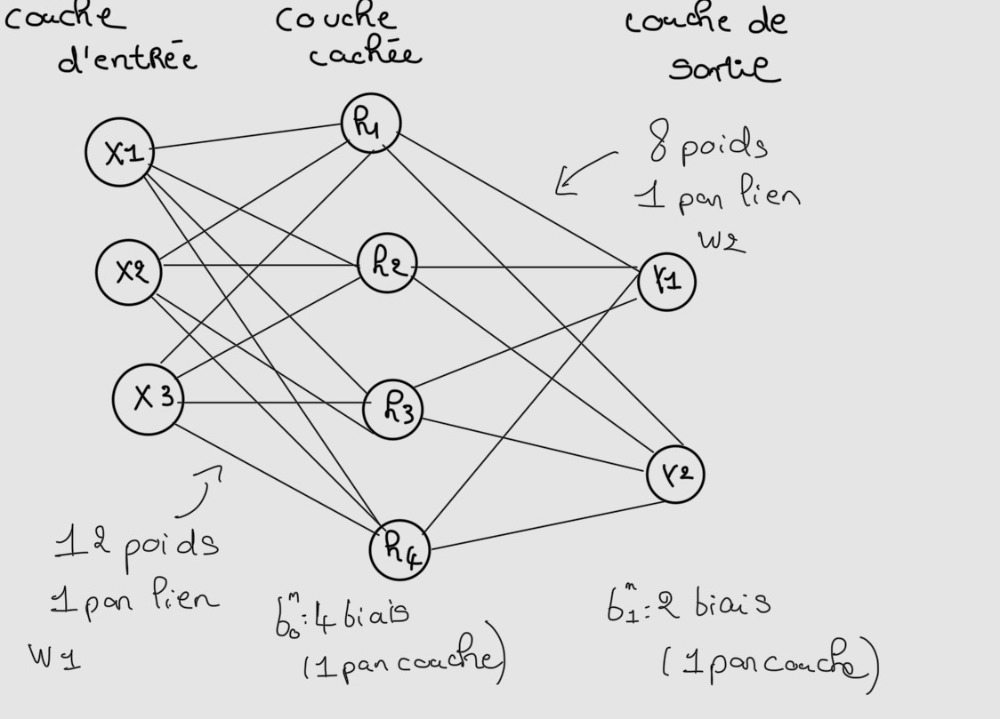
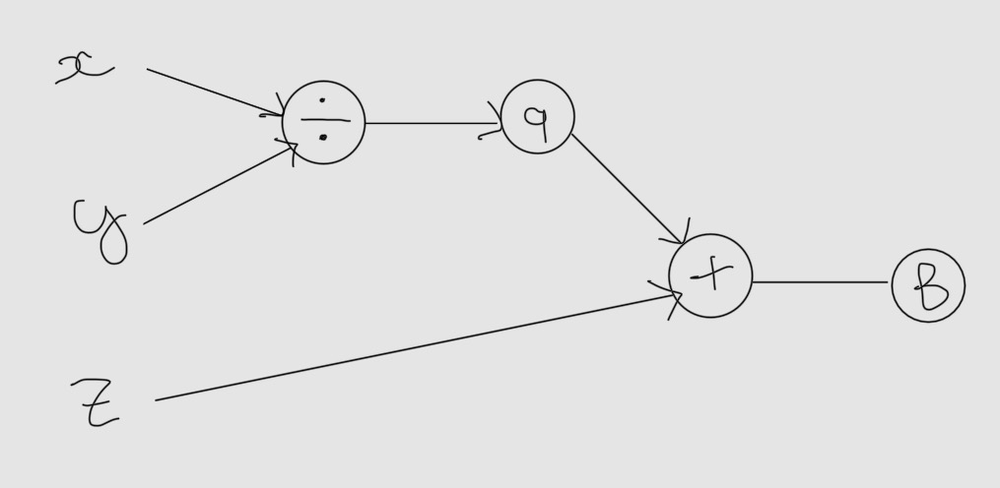
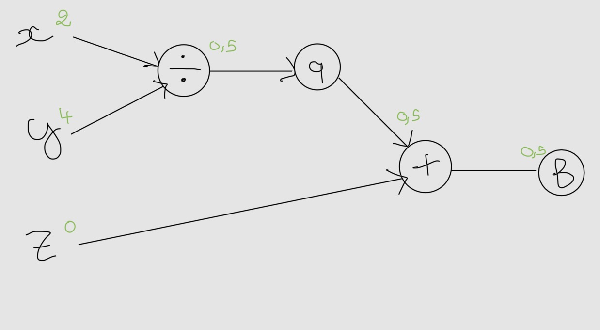
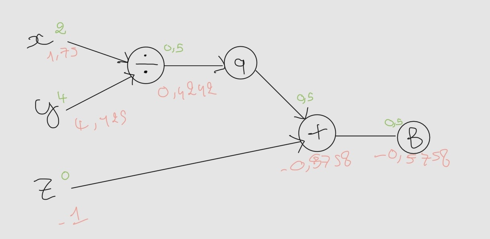
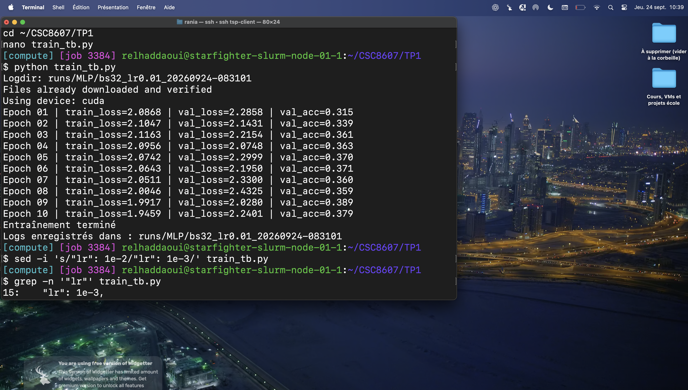
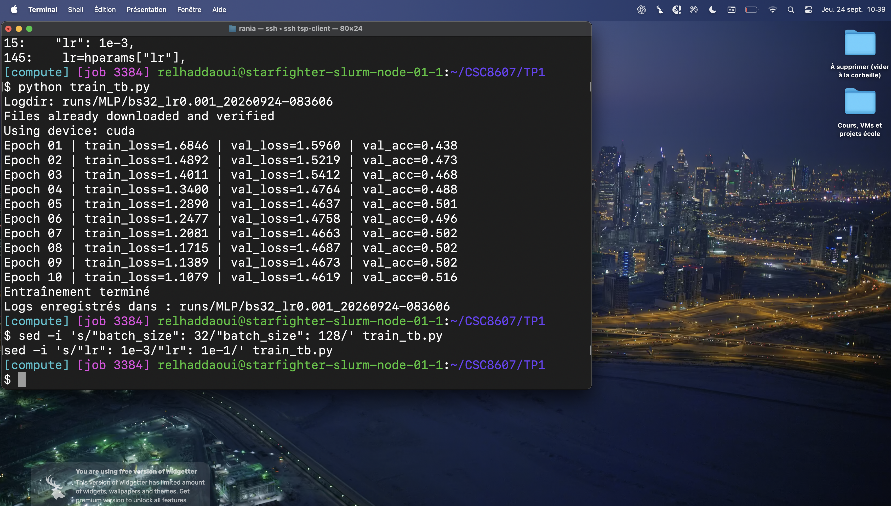
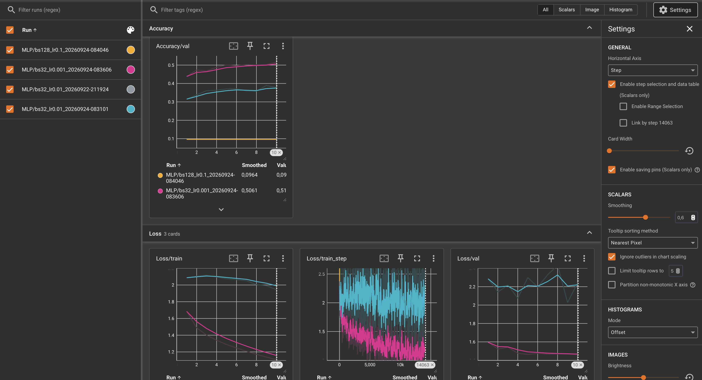

# TP1 — Premiers pas en deep learning

## 1. Utilisation de SLURM

### Connexion et allocation d'un GPU

Question 1.c :

Depuis mon Mac, je me suis connectée au cluster avec ssh tsp-client.
Sur la machine de connexion, la commande `nvidia-smi` a échoué avec le message : Command 'nvidia-smi' not found.

J'ai ensuite demandé une session interactive avec un GPU, un CPU et 8 Go de mémoire pour une durée maximale d'une heure comme ce qui était écrit dans l'énoncé :

```bash
srun --partition=gpu --gres=gpu:1 --time=01:00:00 --cpus-per-task=1 --mem=8G --pty bash
```

Le job **1759** a d'abord été placé en attente, puis a obtenu des ressources sur le nœud `starfighter-slurm-node-02-1`.

Sur ce nœud, j'ai exécuté `nvidia-smi`. Le GPU attribué est une **NVIDIA L4**, avec **23034 MiB** de mémoire GPU comme on peut le voir sur mon screen.


### Observation et annulation du job

Question 1.d :

Comme dans l'énoncé, j'ai affiché mes jobs avec squeue -u $USER. Le job interactif 1759 était dans l'état `R` (en cours d'exécution). Pour l'annuler, j'ai utilisé :

```bash
scancel 1759
```

### Soumission du script et lecture du log

Question 1.e :

J'ai soumis le script hello.sh avec sbatch hello.sh. Slurm lui a attribué le numéro 1778. Le fichier de sortie de log généré est `logs/hello-slurm-1778.out. Je l'ai lu avec :

```bash
cat logs/hello-slurm-1778.out
```

Il contient les informations du GPU NVIDIA L4 et le message « Bonjour depuis SLURM ! ». Le fichier d'erreurs associé, `logs/hello-slurm-1778.err`, est vide.

### Analyse du job terminé

Question 1.f :

```bash
sacct -j 1778 --format=JobID,State,Elapsed,MaxRSS,ReqMem,ReqCPUS
```

Premièrement, on a ReqMem qui est la mémoire RAM demandée. En revanche, MaxRSS est le maximum de mémoire résidente qui est mesuré par Slurm.
J'ai demandé ReqMem = 8G de RAM et 1 CPU. Et 1778.batch affiche MaxRSS = 17900K, soit environ 17,5 Mio.

## 2. Environnement Python

### Activation et vérification de Python

Question 2.b :

Après une interruption de la création de l'environnement, j'ai terminé l'installation de Python avec :

```bash
~/miniforge3/bin/mamba install -n deeplearning python=3.10
```

L'installation s'est terminée avec le message que la transaction est terminée. J'ai ensuite activé l'environnement :

```bash
source ~/miniforge3/etc/profile.d/conda.sh
conda activate deeplearning
```

Pour vérifier l'environnement actif, la version exacte de Python et le chemin de son exécutable, j'ai utilisé :

```bash
echo "$CONDA_DEFAULT_ENV"
python --version
which python
```

Résultat :

```text
deeplearning
Python 3.10.21
/mnt/hdd/homes/relhaddaoui/miniforge3/envs/deeplearning/bin/python
```

Le chemin confirme que le Python utilisé appartient à l'environnement `deeplearning`.


### Vérification de PyTorch et CUDA

L'installation initiale avait sélectionné une variante CPU de PyTorch. J'ai sélectionné PyTorch 2.5.1 avec CUDA 12.1, torchvision 0.20.1 et torchaudio 2.5.1 depuis le canal pytorch. Après la fin de l'installation, j'ai exécuté :

```bash
~/miniforge3/envs/deeplearning/bin/python ~/CSC8607/TP1/check_gpu.py
```

Sortie obtenue sur le nœud de calcul, dans le job 2274 :

```text
PyTorch version: 2.5.1
CUDA available: True
Device count: 1
Device 0 name: NVIDIA L4
```

PyTorch détecte un "GPU NVIDIA L4" et indique que CUDA est disponible.

Si `CUDA available` avait retourné `False`, deux causes possibles auraient été l'installation d'une version CPU de PyTorch ou l'exécution du script sur la machine de connexion sans réservation d'un nœud avec GPU.


### Environnement reproductible

Question 2.e :

J'ai exporté les dépendances principales de l'environnement dans le fichier `environment.yml` avec :

```bash
mamba env export --from-history -n deeplearning > environment.yml
```

Ce fichier permet de conserver les versions de Python, PyTorch et CUDA nécessaires au projet afin de recréer l'environnement sur une autre machine.

### Version de TensorBoard

Question 2.f :

J'ai affiché la version de TensorBoard avec :

```bash
~/miniforge3/envs/deeplearning/bin/tensorboard --version
```

La version installée est **2.20.0**.

## 3. Exercices théoriques

### Architecture et paramètres

Question 3.a :

Le réseau comporte une couche d'entrée de 3 neurones, une couche cachée de 4 neurones et une couche de sortie de 2 neurones. Chaque neurone d'une couche est relié à tous les neurones de la couche suivante.



Calcul détaillé sans les biais :

```text
Couche 1 (entrée → couche cachée) : 3 × 4 = 12 poids
Couche 2 (couche cachée → sortie) : 4 × 2 = 8 poids
Total sans biais : 12 + 8 = 20 paramètres
```

Calcul détaillé avec les biais :

```text
Couche 1 : (3 × 4) + 4 biais = 12 + 4 = 16 paramètres
Couche 2 : (4 × 2) + 2 biais = 8 + 2 = 10 paramètres
Total avec biais : 16 + 10 = 26 paramètres
```

La couche d'entrée ne possède pas de biais appris car les biais appartiennent aux neurones des couches cachée et de sortie.

Question 3.b :

Les équations du forward pass sont :

```text
H = ReLU(X · W1ᵀ + b1)
Y = H · W2ᵀ + b2
```

Les dimensions sont :

```text
X  : (N, 3)
W1 : (4, 3)
b1 : (1, 4) → diffusé en (N, 4)
H  : (N, 4)
W2 : (2, 4)
b2 : (1, 2) → diffusé en (N, 2)
Y  : (N, 2)
```


### Graphe de calcul et rétropropagation

Question 3.c :

On considère la fonction :

```text
f(x, y, z) = x / y + z
```

Le calcul est séparé en deux opérations. Le nœud intermédiaire est `q = x / y`, puis la sortie est `f = q + z` :



```text
x ──┐
    ├── division ──> q ──┐
y ──┘                    ├── addition ──> f
z ───────────────────────┘
```

Pour `x = 2`, `y = 4` et `z = 0`, le forward pass donne :

```text
q = x / y = 2 / 4 = 0,5
f = q + z = 0,5 + 0 = 0,5
```



Pour la backpropagation, on commence par l'addition `f = q + z` :

```text
∂f/∂q = 1
∂f/∂z = 1
```

Pour la division `q = x / y` :

```text
∂q/∂x = 1/y = 1/4 = 0,25
∂q/∂y = -x/y² = -2/4² = -2/16 = -0,125
```

En appliquant la règle de la chaîne :

```text
∂f/∂x = (∂f/∂q)(∂q/∂x) = 1 × 0,25 = 0,25
∂f/∂y = (∂f/∂q)(∂q/∂y) = 1 × (-0,125) = -0,125
∂f/∂z = 1
```

Les gradients au point `(2, 4, 0)` sont donc `∂f/∂x = 0,25`, `∂f/∂y = -0,125` et `∂f/∂z = 1`.

### Mise à jour des poids

La règle de mise à jour avec un learning rate `η = 1` est :

```text
nouvelle valeur = ancienne valeur - η × gradient
```

À partir de `x = 2`, `y = 4`, `z = 0` et des gradients précédents :

```text
x' = 2 - 1 × 0,25 = 1,75
y' = 4 - 1 × (-0,125) = 4,125
z' = 0 - 1 × 1 = -1
```

La nouvelle valeur de la fonction est :

```text
f' = x'/y' + z'
   = 1,75/4,125 - 1
   ≈ 0,4242 - 1
   ≈ -0,5758
```

La fonction est passée de `f = 0,5` à `f' ≈ -0,5758`. Sa valeur a donc diminué, comme attendu avec une étape de descente de gradient.



### Questions de réflexion

Nous utilisons règle de la chaîne est utilisée parce qu'un réseau profond est une succession de fonctions composées. Elle permet de transmettre le gradient depuis la sortie vers les premières couches en multipliant les dérivées locales de chaque opération. Par exemple, pour avoir un biais de la couche cachée d'un réseau nous utilisons le gradient du biais après lui dans la dernière couche du réseau.

Les mini-batchs utilisent efficacement le calcul parallèle du GPU, nécessitent moins de mémoire qu'un traitement de toutes les données à la fois et fournissent des gradients moins instables qu'un calcul sur un seul exemple.

### Fonction de sortie et fonction de perte

| Tâche | Fonction finale | Fonction de perte usuelle |
|---|---|---|
| Classification binaire | Sigmoïde | Entropie croisée binaire (BCE) |
| Classification multiclasse | Softmax | Entropie croisée (Cross-Entropy) |
| Régression pure | Identité, aucune activation | MSE (Mean Squared Error) |

En PyTorch, `BCEWithLogitsLoss` combine la sigmoïde et la BCE, tandis que `CrossEntropyLoss` combine le traitement Softmax logarithmique et l'entropie croisée. On fournit donc directement les logits à ces fonctions de perte.

## 4. Premier réseau de neurones avec CIFAR-10

### Préparation des données

Question 4.a :

L'argument `batch_size` indique le nombre d'images traitées ensemble avant de calculer la perte et de mettre à jour les poids du réseau. Avec `batch_size=32`, le modèle traite donc les images par groupes de 32.

L'argument `shuffle` comme vu lors de l'entraînement au CC1 permet d'indiquer si les données sont mélangées avant chaque parcours du jeu de données.

Pour l'entraînement, `shuffle=True` évite que le modèle apprenne l'ordre des exemples et rend les mini-batchs plus variés.

Pour le test, `shuffle=False` conserve un ordre stable, car aucun apprentissage ni aucune mise à jour des poids n'est effectué et le mélange ne modifierait pas la précision finale.

### Implémentation du réseau

Question 4.b :

Dans la méthode `forward`, `torch.flatten(x, 1)` transforme chaque image de taille `3 × 32 × 32` en un vecteur de `3072` valeurs c'est le format attendu par la première couche linéaire.
L'argument `1` indique que l'aplatissement commence à la dimension 1 : la dimension 0, qui représente le nombre d'images du batch, est donc conservée. Une entrée de forme `(batch_size, 3, 32, 32)` devient ainsi `(batch_size, 3072)`.

Il ne faut pas ajouter `Softmax` à la sortie du réseau lorsque `nn.CrossEntropyLoss` est utilisée. Elle attend déjà les logits et applique elle-même Softmax. Ajouter un Softmax par-dessus effectuerait une transformation inutile et pourrait produire des gradients moins utiles à l'apprentissage.

Question 4.c :

La différence entre optimizer.zero_grad() et loss.backward() est que le premier sert à remettre à 0 le calcul des gradients pour ne pas garder les précédents sinon ils seront additionnés et tout le calcul sera faux. Le deuxième permet de commencer le calcul des gradients à partir de la loss.

### Évaluation sur le jeu de test

Question 4.d :

On utilise le bloc with torch.no_grad() pour ne pas recalculer les gradients comme à l'entraînement. Cela ne sert plus du tout à rien lors de l'évaluation. Cela permet d'utiliser moins de mémoire sur le GPU, ne construit pas le graphe de calcul et fait les calculs donc plus rapidement.

CIFAR-10 contient 10 classes. Un classificateur qui choisit uniformément une classe au hasard a une chance sur 10 de trouver la bonne réponse. Sa précision attendue est donc d'environ `1/10 = 0,10`, soit **10 %**.

### Résultats de l'entraînement

L'entraînement a été exécuté sur le GPU avec `Using device: cuda`. Les résultats obtenus sont :

```text
Epoch 01 | loss=2.0830 | acc=0.3334
Epoch 02 | loss=2.1251 | acc=0.3586
Epoch 03 | loss=2.1198 | acc=0.3682
Epoch 04 | loss=2.0930 | acc=0.3819
Epoch 05 | loss=2.0538 | acc=0.3897
Epoch 06 | loss=2.0477 | acc=0.3943
Epoch 07 | loss=2.0145 | acc=0.4041
Epoch 08 | loss=1.9995 | acc=0.4099
Epoch 09 | loss=1.9602 | acc=0.4211
Epoch 10 | loss=1.9462 | acc=0.4248
Test accuracy: 0.387
```

Après 10 époques, le modèle obtient 42,48 % de précision à l’entraînement et 38,7 % au test. Il fait donc mieux qu’un choix aléatoire à 10 %. Ses poids sont enregistrés dans mlp_model.pth.


## 5. Utilisation de TensorBoard

### Préparation et premier entraînement

Question 5.a :

La date, l'heure et les hyperparamètres sont inclus dans `run_name` pour identifier précisément chaque entraînement, éviter d'écraser les résultats précédents et faciliter la comparaison des expériences dans TensorBoard.

Le premier run utilise `batch_size=32` et `lr=0.01`. Les logs ont été enregistrés dans `runs/MLP/bs32_lr0.01_20260922-211924`. Les résultats sont :

```text
Epoch 01 | train_loss=2.0868 | val_loss=2.2858 | val_acc=0.315
Epoch 02 | train_loss=2.1047 | val_loss=2.1431 | val_acc=0.339
Epoch 03 | train_loss=2.1163 | val_loss=2.2154 | val_acc=0.361
Epoch 04 | train_loss=2.0956 | val_loss=2.0748 | val_acc=0.363
Epoch 05 | train_loss=2.0742 | val_loss=2.2999 | val_acc=0.370
Epoch 06 | train_loss=2.0643 | val_loss=2.1950 | val_acc=0.371
Epoch 07 | train_loss=2.0511 | val_loss=2.3300 | val_acc=0.360
Epoch 08 | train_loss=2.0046 | val_loss=2.4325 | val_acc=0.359
Epoch 09 | train_loss=1.9917 | val_loss=2.0280 | val_acc=0.389
Epoch 10 | train_loss=1.9459 | val_loss=2.2401 | val_acc=0.379
```

La meilleure précision de validation de ce run est **38,9 %**, obtenue à l'époque 9. La perte d'entraînement diminue globalement, tandis que la perte de validation varie davantage.



### Visualisation dans TensorBoard

Dans l'onglet `Scalars`, un niveau de smoothing de **0,6** permet de distinguer clairement la tendance de `Loss/train_step` sans masquer complètement les variations importantes. La courbe `Loss/train_step` est plus bruitée parce que chaque point correspond à la perte d'un seul mini-batch de 32 images. Ainsi certains lots sont plus faciles ou plus difficiles que d'autres. À l'inverse, `Loss/train` est calculée comme une moyenne sur tous les mini-batchs d'une époque, ce qui réduit fortement les fluctuations.

### Deuxième run

Le deuxième run utilise `batch_size=32` et `lr=0.001`. Les logs ont été enregistrés dans `runs/MLP/bs32_lr0.001_20260924-083606`.

```text
Epoch 01 | train_loss=1.6846 | val_loss=1.5960 | val_acc=0.438
Epoch 02 | train_loss=1.4892 | val_loss=1.5219 | val_acc=0.473
Epoch 03 | train_loss=1.4011 | val_loss=1.5412 | val_acc=0.468
Epoch 04 | train_loss=1.3400 | val_loss=1.4764 | val_acc=0.488
Epoch 05 | train_loss=1.2890 | val_loss=1.4637 | val_acc=0.501
Epoch 06 | train_loss=1.2477 | val_loss=1.4758 | val_acc=0.496
Epoch 07 | train_loss=1.2081 | val_loss=1.4663 | val_acc=0.502
Epoch 08 | train_loss=1.1715 | val_loss=1.4687 | val_acc=0.502
Epoch 09 | train_loss=1.1389 | val_loss=1.4673 | val_acc=0.502
Epoch 10 | train_loss=1.1079 | val_loss=1.4619 | val_acc=0.516
```

La meilleure précision de validation est **51,6 %**, atteinte à l'époque 10. Ce run est nettement meilleur que le premier run, dont la meilleure précision était de 38,9 %.



### Troisième run

Le troisième run utilise `batch_size=128` et `lr=0.1`. Les logs ont été enregistrés dans `runs/MLP/bs128_lr0.1_20260924-084046`.

```text
Epoch 01 | train_loss=nan | val_loss=nan | val_acc=0.096
Epoch 02 | train_loss=nan | val_loss=nan | val_acc=0.096
Epoch 03 | train_loss=nan | val_loss=nan | val_acc=0.096
Epoch 04 | train_loss=nan | val_loss=nan | val_acc=0.096
Epoch 05 | train_loss=nan | val_loss=nan | val_acc=0.096
Epoch 06 | train_loss=nan | val_loss=nan | val_acc=0.096
Epoch 07 | train_loss=nan | val_loss=nan | val_acc=0.096
Epoch 08 | train_loss=nan | val_loss=nan | val_acc=0.096
Epoch 09 | train_loss=nan | val_loss=nan | val_acc=0.096
Epoch 10 | train_loss=nan | val_loss=nan | val_acc=0.096
```

`nan` signifie « Not a Number » : les valeurs numériques sont devenues invalides pendant les calculs. Le taux d'apprentissage `0.1` est trop élevé. Les mises à jour des poids sont trop importantes, ce qui provoque une divergence du modèle. La précision reste bloquée à **9,6 %**, soit environ le niveau d'un choix aléatoire parmi les dix classes de CIFAR-10.

### Comparaison des trois runs

| Run | Batch size | Learning rate | Meilleure précision de validation | Observation |
|---|---:|---:|---:|---|
| 1 | 32 | 0.01 | 38,9 % | Apprentissage instable et limité |
| 2 | 32 | 0.001 | 51,6 % | Meilleur résultat |
| 3 | 128 | 0.1 | 9,6 % | Divergence, pertes égales à `nan` |

Le deuxième run obtient la meilleure précision de validation avec **51,6 %**.
Le troisième run montre qu'un taux d'apprentissage trop élevé peut rendre l'entraînement numériquement instable.
Le batch plus grand ne permet pas de compenser un taux d'apprentissage aussi élevé.

### Comparaison graphique dans TensorBoard



La courbe rose donne le meilleur résultat avec 51,6 % de précision. Le premier réglage atteint environ 38 %. Pour la courbe orange, le learning rate est trop élevé, donc le modèle n’arrive plus à apprendre et reste à 9,6 % de précision.

On détecte un surapprentissage lorsque le modèle continue de progresser sur les données d’entraînement, mais devient moins performant sur les données de validation. Dans ce cas, la perte d’entraînement baisse tandis que la perte de validation augmente et que la précision de validation stagne ou diminue. Pour notre deuxième essai, la perte d’entraînement diminue régulièrement et la perte de validation reste proche de 1,46. Il n’y a donc pas encore de surapprentissage important, même si un petit écart commence à apparaître entre les deux courbes.
