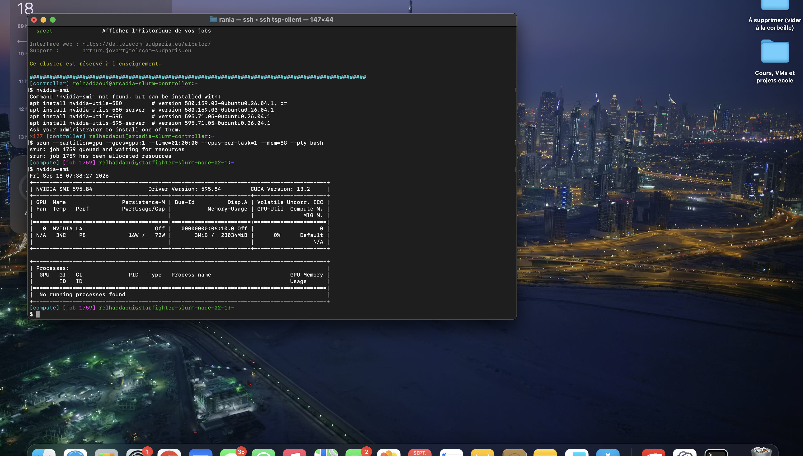
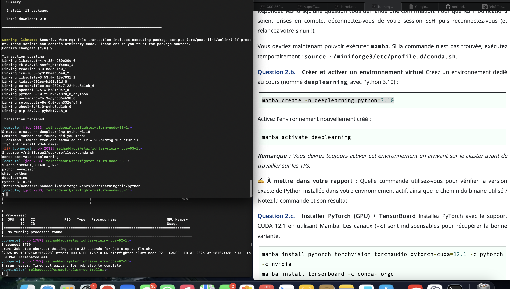
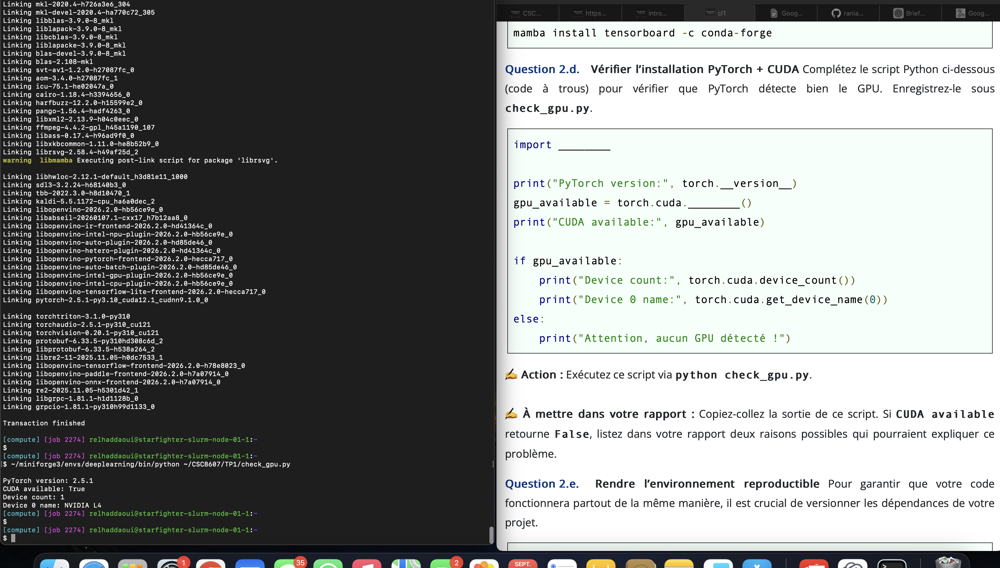

# TP1 — Premiers pas en deep learning

## 1. Utilisation de SLURM

### Connexion et allocation d'un GPU

Depuis mon Mac, je me suis connectée au cluster avec `ssh tsp-client`.
Sur la machine de connexion, la commande `nvidia-smi` a échoué avec le message `Command 'nvidia-smi' not found`.

J'ai ensuite demandé une session interactive avec un GPU, un CPU et 8 Go de mémoire pour une durée maximale d'une heure :

```bash
srun --partition=gpu --gres=gpu:1 --time=01:00:00 --cpus-per-task=1 --mem=8G --pty bash
```

Le job **1759** a d'abord été placé en attente, puis a obtenu des ressources sur le nœud `starfighter-slurm-node-02-1`.

Sur ce nœud, j'ai exécuté `nvidia-smi`. Le GPU attribué est une **NVIDIA L4**, avec **23034 MiB** de mémoire GPU indiqués par la commande.



### Observation et annulation du job

J'ai affiché mes jobs avec `squeue -u $USER`. Le job interactif 1759 était dans l'état `R` (en cours d'exécution). Pour l'annuler, j'ai utilisé :

```bash
scancel 1759
```

### Soumission du script et lecture du log

J'ai soumis le script `hello.sh` avec `sbatch hello.sh`. Slurm lui a attribué le numéro **1778**. Le fichier de sortie généré est **`logs/hello-slurm-1778.out`**. Je l'ai lu avec :

```bash
cat logs/hello-slurm-1778.out
```

Il contient les informations du GPU NVIDIA L4 et le message « Bonjour depuis SLURM ! ». Le fichier d'erreurs associé, `logs/hello-slurm-1778.err`, est vide.

### Analyse du job terminé

```bash
sacct -j 1778 --format=JobID,State,Elapsed,MaxRSS,ReqMem,ReqCPUS
```

Le job est dans l'état `COMPLETED`, avec une durée de 1 seconde pour l'étape du script. `ReqMem` est la mémoire RAM demandée, tandis que `MaxRSS` est le maximum de mémoire résidente mesuré par Slurm. J'ai demandé `8G` de RAM et 1 CPU. L'étape `1778.batch` affiche `MaxRSS = 17900K`, soit environ 17,5 Mio.

## 2. Environnement Python

### Activation et vérification de Python

Après une interruption de la création de l'environnement, j'ai terminé l'installation de Python avec :

```bash
~/miniforge3/bin/mamba install -n deeplearning python=3.10
```

L'installation s'est terminée avec le message `Transaction finished`. J'ai ensuite activé l'environnement :

```bash
source ~/miniforge3/etc/profile.d/conda.sh
conda activate deeplearning
```

Pour vérifier l'environnement actif, la version exacte de Python et le chemin de son exécutable, j'ai utilisé :

```bash
echo "$CONDA_DEFAULT_ENV"
python --version
which python
```

Résultat :

```text
deeplearning
Python 3.10.21
/mnt/hdd/homes/relhaddaoui/miniforge3/envs/deeplearning/bin/python
```

Le chemin confirme que le Python utilisé appartient à l'environnement `deeplearning`.



### Vérification de PyTorch et CUDA

L'installation initiale avait sélectionné une variante CPU de PyTorch. J'ai explicitement sélectionné PyTorch 2.5.1 avec CUDA 12.1, torchvision 0.20.1 et torchaudio 2.5.1 depuis le canal pytorch. Après la fin de l'installation, j'ai exécuté :

```bash
~/miniforge3/envs/deeplearning/bin/python ~/CSC8607/TP1/check_gpu.py
```

Sortie obtenue sur le nœud de calcul, dans le job 2274 :

```text
PyTorch version: 2.5.1
CUDA available: True
Device count: 1
Device 0 name: NVIDIA L4
```

PyTorch détecte un GPU NVIDIA L4 et indique que CUDA est disponible.



### Environnement reproductible

J'ai exporté les dépendances principales de l'environnement dans le fichier `environment.yml` avec :

```bash
mamba env export --from-history -n deeplearning > environment.yml
```

Ce fichier permet de conserver les versions de Python, PyTorch et CUDA nécessaires au projet afin de recréer l'environnement sur une autre machine.

### Version de TensorBoard

J'ai affiché la version de TensorBoard avec :

```bash
~/miniforge3/envs/deeplearning/bin/tensorboard --version
```

La version installée est **2.20.0**.
