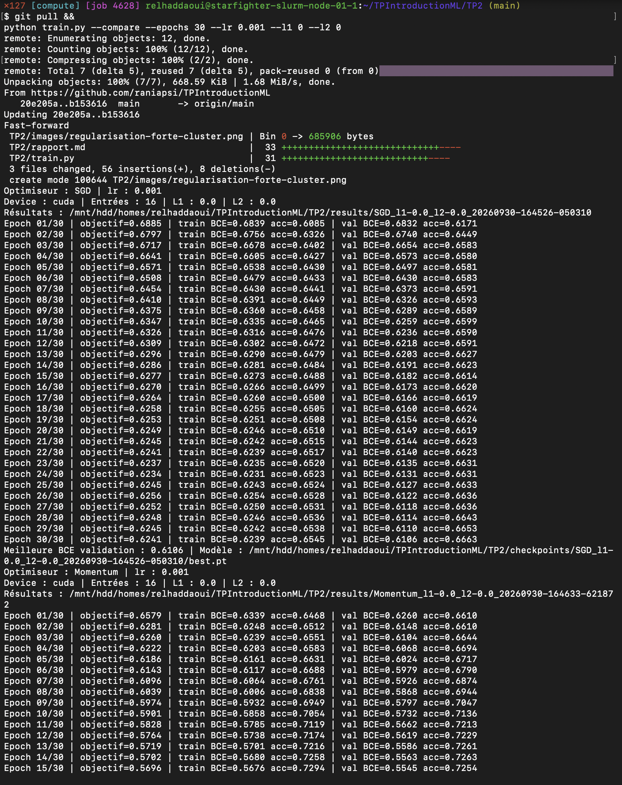
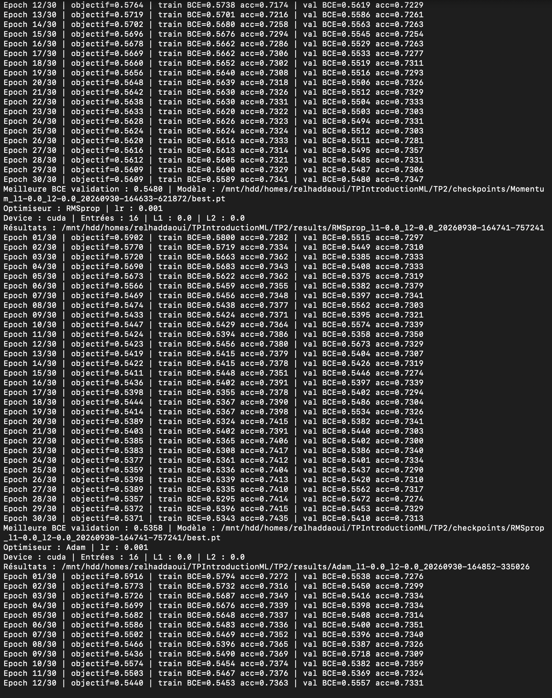
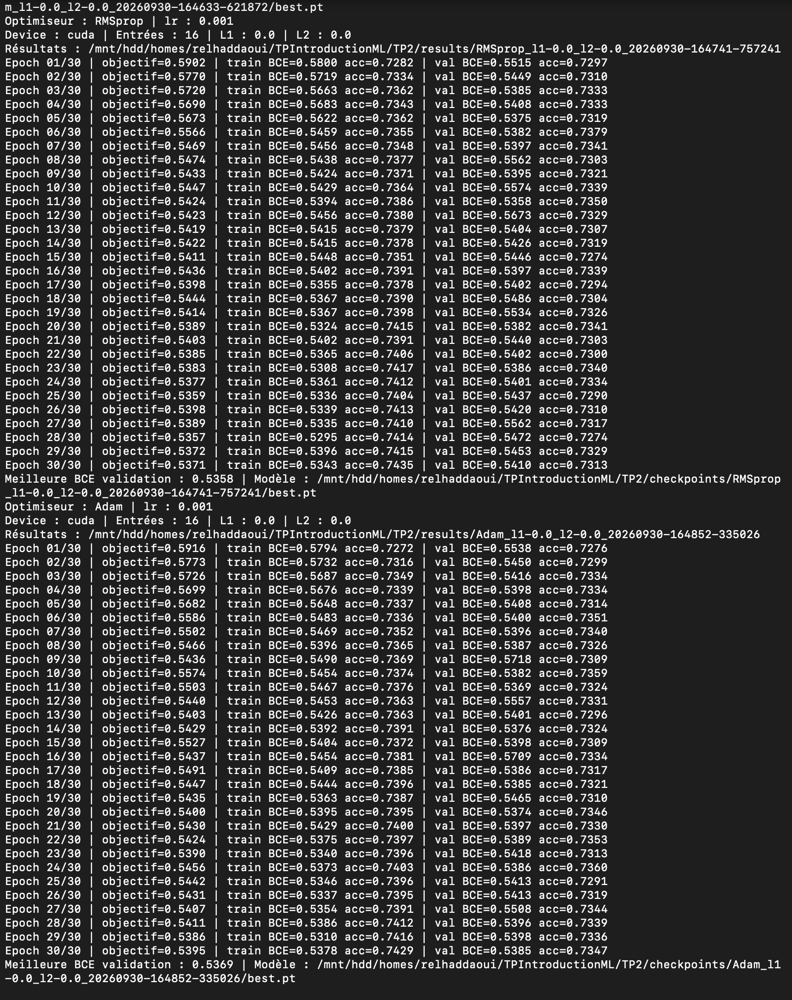
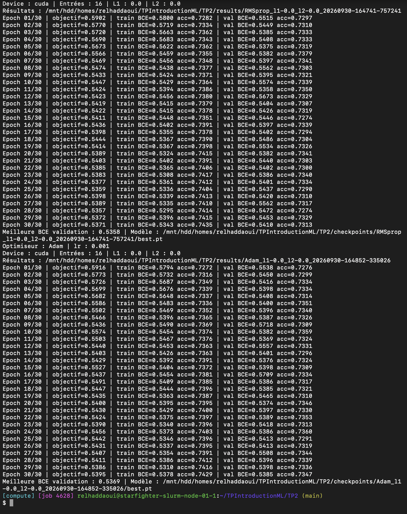
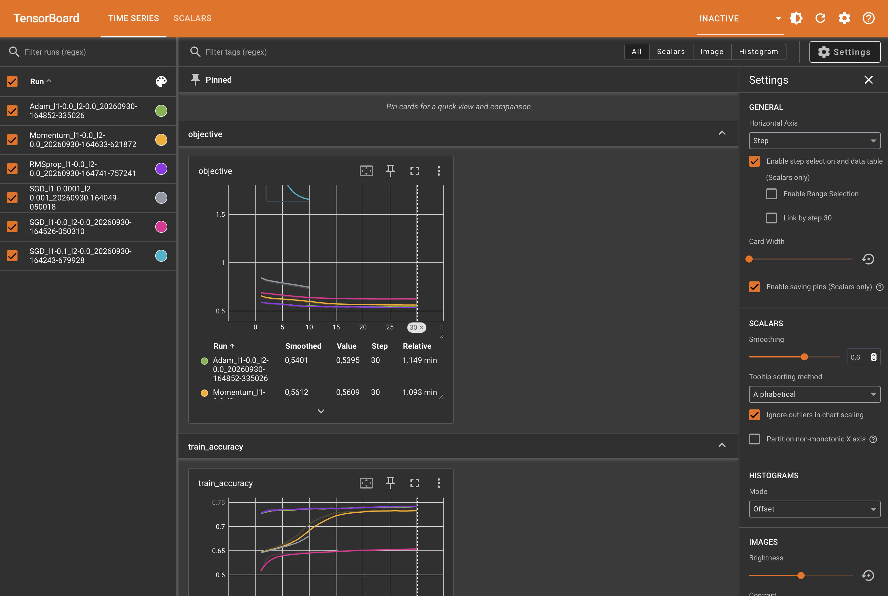
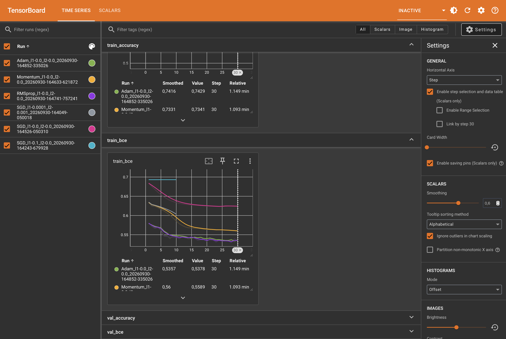

# TP2 — Régularisation, optimisation et métriques

Dans ce TP, je travaille sur la classification de données cardiovasculaires avec PyTorch. L’objectif est de préparer les données, puis d’étudier les régularisations L1/L2, de comparer plusieurs optimiseurs et d’évaluer les prédictions du modèle.

> Rapport en cours : la préparation des données et la première expérience avec régularisation faible ont été exécutées sur le cluster. La comparaison avec L1 forte est également terminée. Les quatre optimiseurs ont été entraînés. La capture TensorBoard et l’évaluation finale restent à réaliser.

## 1. Dataset personnalisé

### Chargement et préparation des données

J’ai placé le fichier `cardio_train.csv` dans `TP2/data/`. Le script `dataset.py` lit le CSV avec le séparateur `;`, applique la suppression des doublons prévue dans le code et retire la colonne `id`. La colonne `cardio` sert de cible : 0 pour l’absence de maladie cardiovasculaire et 1 pour sa présence.

Les variables catégorielles `gender`, `cholesterol` et `gluc` sont transformées par encodage one-hot : une colonne indicatrice est créée pour chaque catégorie. Après cette préparation, chaque patient est représenté par 16 variables.

### Interface PyTorch

`__len__` renvoie le nombre d’exemples. `__getitem__` renvoie les variables
et le label de l’exemple demandé. Le DataLoader rassemble ces exemples en lots.
On mélange les données d’entraînement ; validation et test ne nécessitent pas de mélange.

### Fuite de données (data leakage)

Ajuster StandardScaler sur toutes les données utilise la moyenne et l’écart-type
des ensembles de validation et de test pour préparer l’entraînement.
Ces ensembles doivent rester indépendants de cet ajustement.
Dans notre code, on effectue donc le découpage avant d’ajuster le scaler sur le train,
puis on applique la même transformation aux trois ensembles.

### Données trop volumineuses pour la RAM

On utiliserait `torch.utils.data.IterableDataset` avec une lecture progressive
(par exemple des blocs CSV via `pandas.read_csv(..., chunksize=...)`).
Cette classe ne suffit pas seule : la lecture doit aussi éviter de tout charger en mémoire.

### Vérification sur le cluster

J’ai exécuté le premier script sur le nœud de calcul `starfighter-slurm-node-01-1`, dans le job Slurm 4628, avec l’environnement `deeplearning` :

```bash
source ~/miniforge3/etc/profile.d/conda.sh
conda activate deeplearning
cd ~/TPIntroductionML/TP2
python dataset.py
```


Le script affiche les résultats suivants :

```text
Tailles train / validation / test : [56000, 7000, 7000]
Shape features: torch.Size([64, 16]) Shape labels: torch.Size([64, 1])
Nombre de variables après encodage : 16
```

Les 70 000 exemples sont répartis en 56 000 exemples pour l’entraînement (80 %), 7 000 pour la validation (10 %) et 7 000 pour le test (10 %). Le découpage utilise une graine fixée à 42 pour être reproductible.

La forme `[64, 16]` correspond à un batch de 64 patients possédant chacun 16 variables. La forme `[64, 1]` signifie que chaque patient est associé à un seul label binaire. Ces résultats confirment que le dataset et les DataLoaders peuvent fournir les lots attendus pour l’entraînement.

Pour la suite, la dimension d’entrée du MLP sera déterminée à partir des données : elle vaut ici 16. Il ne faut donc pas reprendre la valeur fixe de 12 figurant dans l’un des exemples de l’énoncé.

## 2. MLP et régularisations L1/L2

### Architecture et fonction de coût

Le script `train.py` définit un MLP avec 16 entrées, deux couches cachées de 128 neurones avec activation ReLU, puis une sortie avec activation sigmoïde. Cette sortie représente la probabilité de la classe 1. La fonction de perte utilisée est la binary cross-entropy (`BCELoss`).

L’objectif optimisé ajoute deux pénalités à cette perte :

$$J = \mathrm{BCE} + \lambda_1 \sum_p |p| + \lambda_2 \sum_p p^2.$$

Comme dans le code de l’énoncé, ces sommes portent sur tous les paramètres, biais compris. À chaque batch, `zero_grad()` efface les gradients précédents, `backward()` calcule les nouveaux gradients et `step()` met à jour les paramètres.

### Protocole de comparaison

Deux expériences sont préparées avec SGD, un taux d’apprentissage de 0,01, 10 époques et la même graine :

```bash
python train.py --l1 0.0001 --l2 0.001
python train.py --l1 0.1 --l2 0
```

Le script enregistre les résultats par époque dans `results/` au format CSV et dans `runs/` pour TensorBoard. Il distingue l’objectif avec pénalités de la BCE seule, afin de comparer les performances prédictives malgré des coefficients de régularisation différents. L’accuracy est calculée au seuil de 0,5. L’ensemble de test n’est pas utilisé à cette étape.

### Résultats avec une régularisation faible

J’ai exécuté `python train.py --l1 0.0001 --l2 0.001` sur le GPU du cluster pendant 10 époques. Le script confirme l’utilisation de CUDA et de 16 variables en entrée.


| Mesure | Époque 1 | Époque 10 |
| --- | ---: | ---: |
| Objectif avec pénalités, moyenne pendant l’époque | 0,8438 | 0,7314 |
| BCE entraînement, en fin d’époque | 0,6348 | 0,5968 |
| Accuracy entraînement | 64,57 % | 68,99 % |
| BCE validation | 0,6272 | 0,5835 |
| Accuracy validation | 66,09 % | 70,03 % |

La BCE diminue sur l’entraînement et sur la validation. L’accuracy de validation progresse de 3,94 points de pourcentage. Le réseau apprend donc des relations utiles avec ces coefficients de régularisation. Sur les 10 époques observées, la perte de validation ne remonte pas : ces résultats ne montrent pas de signe manifeste de surapprentissage.

L’accuracy de validation est légèrement supérieure à celle d’entraînement. Cela peut notamment être lié aux différences entre les exemples des deux ensembles ; cet écart seul ne permet pas de conclure à un problème. L’ensemble de test reste réservé à l’évaluation finale.

### Résultats avec une régularisation L1 forte

J’ai ensuite lancé `python train.py --l1 0.1 --l2 0`, avec la même initialisation et le même découpage des données.


L’objectif total passe de 6,6698 à la première époque à 1,6340 dès la deuxième époque, puis reste stable à la précision affichée. Pourtant, la BCE d’entraînement reste à 0,6931 et l’accuracy de validation oscille entre 49,86 % et 50,14 %. La baisse de l’objectif ne correspond donc pas ici à une amélioration des prédictions : elle est principalement liée à la diminution de la pénalité.

| Mesure à l’époque 10 | L1 = 0,0001 et L2 = 0,001 | L1 = 0,1 et L2 = 0 |
| --- | ---: | ---: |
| BCE entraînement | 0,5968 | 0,6931 |
| Accuracy entraînement | 68,99 % | 50,03 % |
| BCE validation | 0,5835 | 0,6931 |
| Accuracy validation | 70,03 % | 49,86 % |

Avec la régularisation forte, l’accuracy de validation perd 20,17 points de pourcentage. La BCE est proche de `ln(2) ≈ 0,6931`, valeur obtenue avec des probabilités de 0,5. Ces observations sont cohérentes avec un modèle peu informatif. Le réseau ne réussit pas non plus sur l’entraînement : c’est du **sous-apprentissage**. La pénalité L1 exerce une pression trop forte vers des paramètres proches de zéro et empêche l’apprentissage de relations utiles.

Les valeurs sont transcrites depuis les captures. Les historiques CSV et TensorBoard complets sont enregistrés sur le cluster.

### Effet attendu d’une régularisation trop forte

Une pénalité trop forte peut empêcher le réseau d’apprendre les relations utiles : c’est le sous-apprentissage (underfitting). Cet effet est observé dans notre expérience avec L1 à 0,1. Il faut distinguer la BCE seule de l’objectif total qui inclut la pénalité.

### Régularisation L2 dans l’optimiseur

Avec `torch.optim.SGD`, l’argument `weight_decay` permet d’appliquer la régularisation L2. Pour reproduire une pénalité écrite sous la forme `l2_lambda * somme(p²)`, le coefficient équivalent est `weight_decay=2*l2_lambda`, car la dérivée de cette pénalité est `2*l2_lambda*p`. Il ne faut pas cumuler les deux mécanismes pour la même pénalité.

### Différence entre L1 et L2

La régularisation L1 favorise des paramètres nuls ou proches de zéro et peut produire une solution parcimonieuse. L2 réduit les grandes valeurs des paramètres de manière plus progressive, sans favoriser autant leur annulation. Avec les mises à jour SGD utilisées ici, L1 ne garantit pas des zéros exacts.

## 3. Optimiseurs et TensorBoard

Le script propose les optimiseurs SGD, SGD avec momentum de 0,9, RMSprop et Adam. La comparaison réalisée utilise 30 époques, un taux d’apprentissage commun de 0,001 et aucune pénalité L1/L2, comme dans cette partie de l’énoncé. Chaque expérience réinitialise le réseau et les DataLoaders avec la même graine pour comparer les optimiseurs dans les mêmes conditions.

```bash
python train.py --compare --epochs 30 --lr 0.001 --l1 0 --l2 0
```

La BCE d’entraînement, la BCE de validation et les accuracies sont enregistrées dans TensorBoard. Le meilleur état de chaque réseau selon la BCE de validation est conservé pour la future évaluation. Aucun choix ne repose sur le test.

### Résultats des quatre optimiseurs

Les quatre entraînements de 30 époques se sont terminés sur le cluster. Le tableau distingue les performances de la dernière époque de la meilleure BCE de validation enregistrée pendant l’entraînement.

| Optimiseur | BCE train à l’époque 30 | BCE validation à l’époque 30 | Accuracy validation à l’époque 30 | Meilleure BCE validation |
| --- | ---: | ---: | ---: | ---: |
| SGD | 0,6239 | 0,6106 | 66,63 % | 0,6106 |
| Momentum | 0,5589 | 0,5480 | 73,47 % | 0,5480 |
| RMSprop | 0,5343 | 0,5410 | 73,13 % | 0,5358 |
| Adam | 0,5378 | 0,5385 | 73,47 % | 0,5369 |

Ces valeurs sont transcrites depuis les sorties du terminal. Les historiques complets restent disponibles dans les fichiers CSV et les événements TensorBoard sur le cluster.

### Vitesse d’apprentissage initiale

RMSprop et Adam réduisent beaucoup plus vite la perte que SGD. À la première époque, la perte moyenne pendant l’entraînement (`objectif`, égale ici à la BCE sans pénalité) vaut 0,5902 pour RMSprop, 0,5916 pour Adam, 0,6579 pour Momentum et 0,6885 pour SGD. Selon cette mesure, RMSprop a une légère avance sur Adam. En revanche, la BCE recalculée en fin de première époque sur tout le train est légèrement plus basse avec Adam (0,5794 contre 0,5800). Les deux optimiseurs adaptatifs ont donc des résultats initiaux très proches ; le classement dépend de la mesure retenue.

### Effet du momentum

Momentum atteint dès la troisième époque une BCE de validation de 0,6104, alors que SGD atteint 0,6106 après 30 époques. Le momentum conserve une contribution des gradients précédents, ce qui accélère la progression dans les directions persistantes et peut atténuer certaines oscillations. Dans notre expérience, il permet surtout une baisse de perte plus rapide et une meilleure accuracy finale que SGD simple.

### Choix du modèle pour l’évaluation finale

Le critère retenu est la plus faible BCE de validation au cours des 30 époques. RMSprop obtient 0,5358, légèrement devant Adam à 0,5369. Je retiens donc le checkpoint `best.pt` de RMSprop pour la future évaluation sur le test. Son accuracy à la dernière époque n’est pas celle de son meilleur checkpoint : il faut charger l’état sauvegardé, et non utiliser automatiquement le dernier état du réseau.

L’écart entre RMSprop et Adam reste faible et cette comparaison ne porte que sur une graine et un taux d’apprentissage commun. Elle ne démontre pas qu’un optimiseur est systématiquement supérieur aux autres. Les pertes de validation des optimiseurs adaptatifs fluctuent, ce qui justifie de conserver le meilleur état selon la validation.

### Captures des exécutions









### Courbes TensorBoard

J’ai ouvert TensorBoard à partir des événements enregistrés sur le cluster. La vue d’ensemble ci-dessous contient les six expériences, y compris les deux essais de régularisation, avec un lissage de 0,6. Les courbes lissées facilitent la lecture des tendances mais atténuent les fluctuations ; les valeurs du tableau `Value` correspondent aux mesures brutes.





La courbe de BCE de L1 forte reste proche de 0,693, tandis que celles d’Adam et RMSprop diminuent rapidement. Pour ces deux optimiseurs, les courbes sont proches ; Momentum progresse plus graduellement, et SGD simple reste à une perte plus élevée après 30 époques. Les six captures originales sont conservées dans `images/tensorboard-vue-ensemble-1.png` à `images/tensorboard-vue-ensemble-6.png`.

À compléter : une vue ciblée sur les quatre optimiseurs, sans lissage. Pour cette comparaison, sélectionner uniquement les expériences sans régularisation (`l1-0.0_l2-0.0`), et afficher `objective` pour la perte moyenne pendant l’entraînement ou `train_bce` pour la perte recalculée en fin d’époque.

## 4. Métriques

À faire : choisir le modèle sur la validation, évaluer sur le test et interpréter les métriques.
