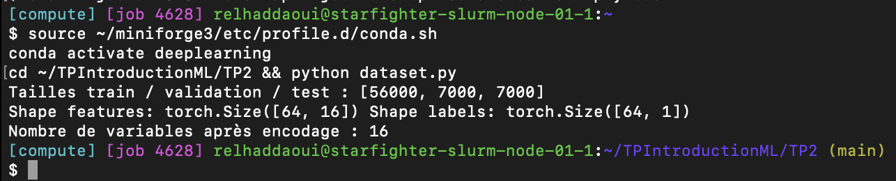
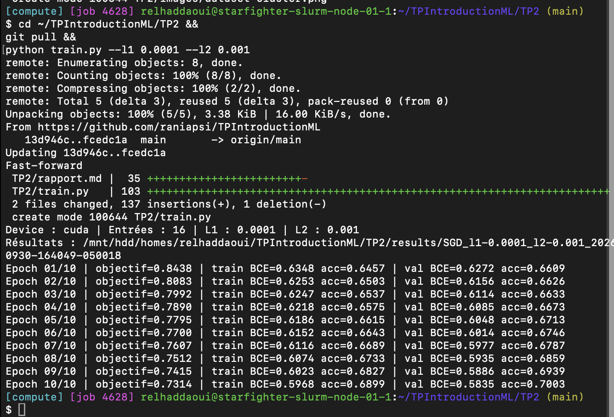
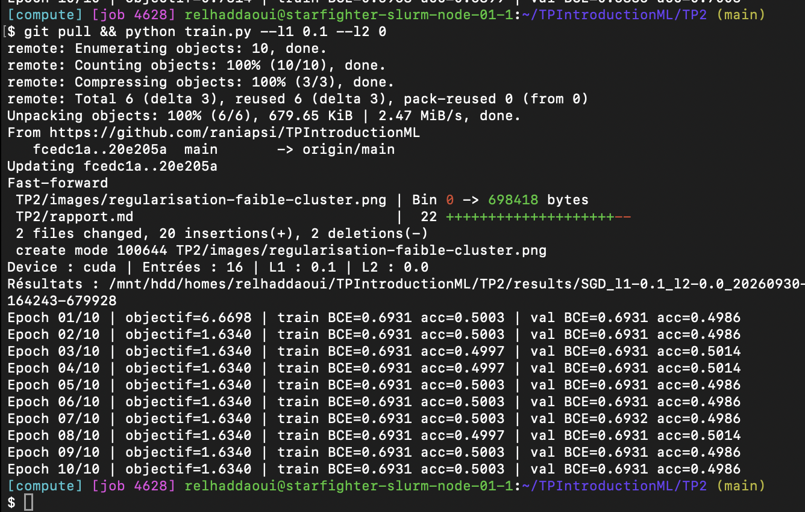
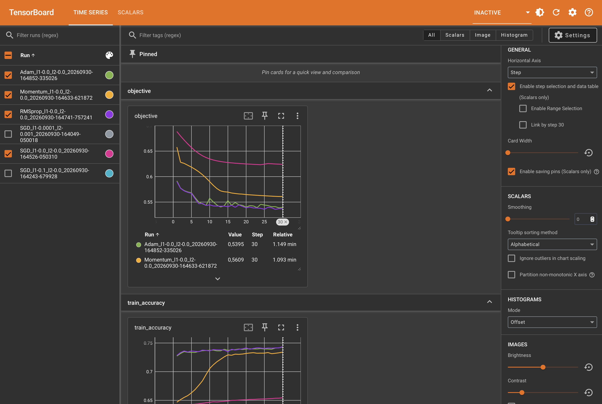
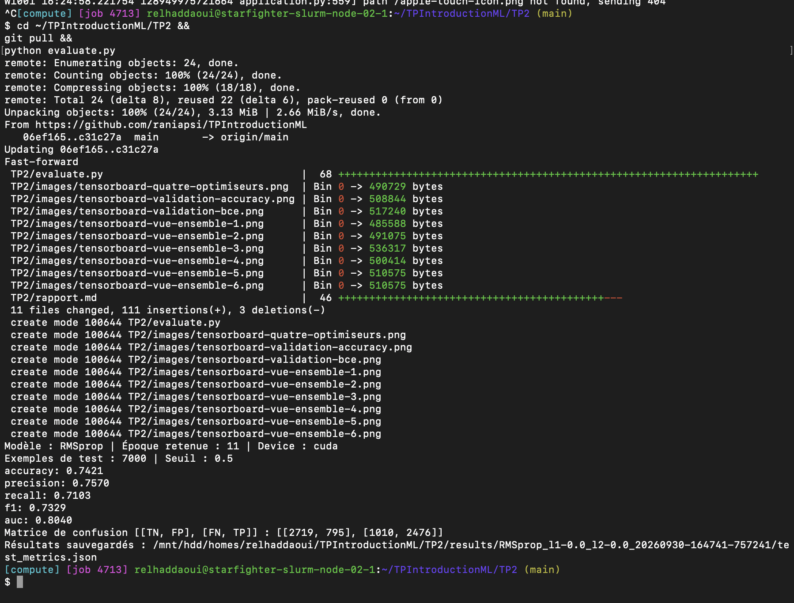

# TP2 — Régularisation, optimisation et métriques

## 1. Dataset personnalisé

**Question 1.a : Pourquoi ne faut-il pas appliquer StandardScaler sur tout le dataset avant le découpage ?**

Cela utilise des informations de la validation et du test pour préparer les données d’entraînement. C’est une fuite de données (*data leakage*). Dans mon code, je fais donc le découpage avant de calculer la moyenne et l’écart-type sur le train seulement. J’utilise ensuite ces mêmes valeurs pour transformer la validation et le test.

**Question 1.b : Quelle classe utiliser si les données ne tiennent pas dans la RAM ?**

J’utiliserais `IterableDataset`, avec une lecture par morceaux pour ne pas charger toutes les données en mémoire.

**Résultats de `dataset.py` :**

J’obtiens 56 000 exemples pour le train, 7 000 pour la validation et 7 000 pour le test, soit 80 %, 10 % et 10 %. Un batch contient 64 patients avec 16 variables chacun (`[64, 16]`) et un label par patient (`[64, 1]`).

## 2. MLP et régularisation L1/L2

**Question 2.a : Que se passe-t-il avec L1 = 0,1 et L2 = 0 ?**

J’ai comparé deux entraînements de 10 époques avec SGD et un taux d’apprentissage de 0,01.

| Résultat à l’époque 10 | L1 = 0,0001 et L2 = 0,001 | L1 = 0,1 et L2 = 0 |
| --- | ---: | ---: |
| BCE train | 0,5968 | 0,6931 |
| Accuracy train | 68,99 % | 50,03 % |
| BCE validation | 0,5835 | 0,6931 |
| Accuracy validation | 70,03 % | 49,86 % |

Avec L1 à 0,1, l’accuracy reste autour de 50 % et la BCE autour de 0,6931. La pénalité est trop forte et pousse les paramètres vers zéro, ce qui empêche le réseau d’apprendre correctement. C’est du **sous-apprentissage** (*underfitting*).

L’objectif total diminue de 6,6698 à 1,6340, mais les prédictions ne s’améliorent pas : cette baisse vient surtout de la pénalité. Il faut donc regarder aussi la BCE seule et l’accuracy.

**Question 2.b : Quel argument permet d’appliquer L2 dans l’optimiseur ?**

C’est `weight_decay`. Avec SGD, pour retrouver exactement notre pénalité `l2_lambda * somme(p²)`, il faut mettre `weight_decay=2*l2_lambda`. Il ne faut pas ajouter en plus la même pénalité à la main.

**Question 2.c : Quelle est la différence entre L1 et L2 ?**

L1 favorise des poids nuls ou proches de zéro. L2 réduit surtout les grandes valeurs des poids, sans chercher autant à les annuler.

## 3. Optimiseurs et TensorBoard

J’ai comparé SGD, Momentum, RMSprop et Adam pendant 30 époques, avec un taux d’apprentissage de 0,001 et sans régularisation. Le réseau, la graine et le découpage sont les mêmes pour les quatre essais.

**Question 3.a : Capture des courbes de perte des quatre optimiseurs.**

Les quatre courbes sont affichées sans lissage. `objective` correspond ici à la BCE moyenne pendant chaque époque, puisqu’il n’y a pas de pénalité.

| Optimiseur | BCE validation à l’époque 30 | Accuracy validation à l’époque 30 | Meilleure BCE validation |
| --- | ---: | ---: | ---: |
| SGD | 0,6106 | 66,63 % | 0,6106 |
| Momentum | 0,5480 | 73,47 % | 0,5480 |
| RMSprop | 0,5410 | 73,13 % | 0,5358 |
| Adam | 0,5385 | 73,47 % | 0,5369 |

**Question 3.b : Quel optimiseur converge le plus vite au début ?**

RMSprop et Adam sont les plus rapides. Sur la perte moyenne de la première époque, RMSprop est légèrement devant : 0,5902 contre 0,5916 pour Adam. Leurs résultats restent très proches.

**Question 3.c : Quel est l’effet du momentum par rapport à SGD simple ?**

Le momentum garde une partie de l’effet des gradients précédents. Cela aide à avancer plus vite dans une même direction et peut réduire les oscillations. Ici, Momentum atteint une BCE de validation de 0,6104 dès l’époque 3, alors que SGD atteint 0,6106 à l’époque 30.

## 4. Métriques

Pour le test, j’ai repris le modèle RMSprop sauvegardé à l’époque 11 : c’est celui qui avait la plus faible BCE de validation (0,5358). Le choix a été fait avant de regarder le test.

**Résultats sur les 7 000 exemples de test, avec un seuil de 0,5 :**

| Métrique | Résultat |
| --- | ---: |
| Accuracy | 74,21 % |
| Précision | 75,70 % |
| Rappel | 71,03 % |
| F1 | 0,7329 |
| AUC | 0,8040 |

| Classe réelle | Prédit 0 | Prédit 1 |
| --- | ---: | ---: |
| 0 | 2 719 vrais négatifs | 795 faux positifs |
| 1 | 1 010 faux négatifs | 2 476 vrais positifs |

**Question 4.a : Quelle est la définition de la précision et du rappel ?**

La précision est la proportion de vrais positifs parmi les patients prédits positifs : `TP / (TP + FP)`. Ici, cela donne `2476 / (2476 + 795) = 75,70 %`.

Le rappel est la proportion de cas positifs détectés parmi tous les cas réellement positifs : `TP / (TP + FN)`. Ici, cela donne `2476 / (2476 + 1010) = 71,03 %`.

**Question 4.b : Dans ce contexte, faut-il privilégier la précision ou le rappel ?**

Je privilégierais le rappel pour manquer le moins possible de patients malades. Dans mes résultats, le modèle manque encore 1 010 cas positifs sur 3 486. Il faut quand même surveiller les faux positifs, car augmenter le rappel peut aussi augmenter les fausses alertes.

**Question 4.c : À quoi sert l’AUC par rapport aux métriques au seuil de 0,5 ?**

L’AUC mesure la capacité du modèle à donner des scores plus élevés aux positifs qu’aux négatifs, en considérant différents seuils. Elle ne dépend donc pas seulement du seuil de 0,5. Ici, elle vaut 0,8040, ce qui est supérieur au niveau aléatoire de 0,5. Cela ne veut pas dire que 80,40 % des prédictions sont correctes : cette proportion est l’accuracy, qui vaut 74,21 %.
